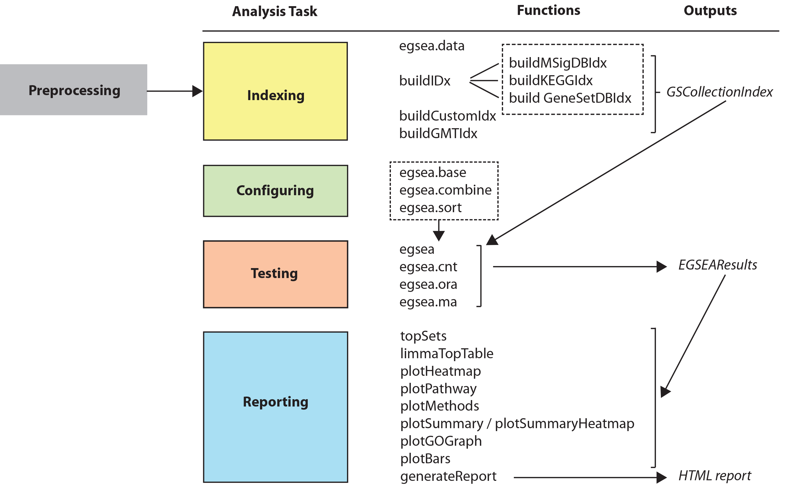
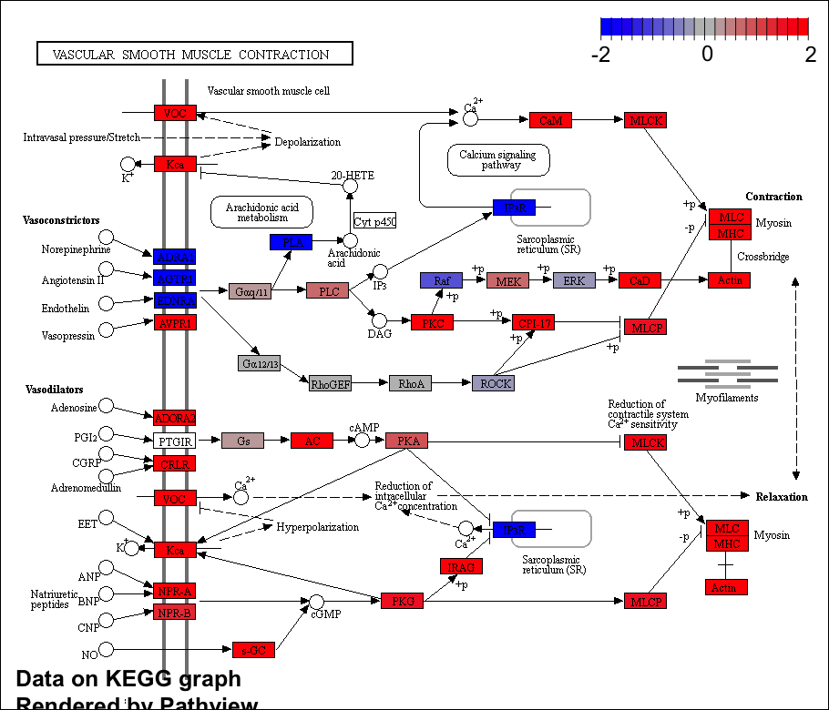

# Abstract

Gene set enrichment analysis is a popular approach for prioritising the biological processes perturbed in genomic datasets. 
The Bioconductor project hosts over 80 software packages capable of gene set analysis. 
Most of these packages search for enriched signatures amongst differentially regulated genes to reveal higher level biological themes that may be missed when focusing only on evidence from individual genes.
With so many different methods on offer, choosing the best algorithm and visualization approach can be challenging. 
The **EGSEA** package solves this problem by combining results from up to 12 prominent gene set testing algorithms to obtain a consensus ranking of biologically relevant results.
This workflow demonstrates how **EGSEA** can extend **limma**-based differential expression analyses for RNA-seq and microarray data using experiments that profile 3 distinct cell populations important for studying the origins of breast cancer. 
Following data normalization and set-up of an appropriate linear model for differential expression analysis, **EGSEA** builds gene signature specific indexes that link a wide range of mouse or human gene set collections obtained from MSigDB, GeneSetDB and KEGG to the gene expression data being investigated. 
**EGSEA** is then configured and the ensemble enrichment analysis run, returning an object that can be queried using several S4 methods for ranking gene sets and visualizing results via heatmaps, KEGG pathway views, GO graphs, scatter plots and bar plots. 
Finally, an HTML report that combines these displays can fast-track the sharing of results with collaborators, and thus expedite downstream biological validation. 
**EGSEA** is simple to use and can be easily integrated with existing gene expression analysis pipelines for both human and mouse data.


# Introduction

Gene set enrichment analysis allows researchers to efficiently extract biological insights from long lists of differentially expressed genes by interrogating them at a systems level. In recent years, there has been a proliferation of gene set enrichment (GSE)  analysis methods released through the Bioconductor project [@Huber:NatureMethods:2015] together with a steady increase in the number of gene set collections available through online databases such as MSigDB [@Subramanian2005], GeneSetDB [@Araki2012] and KEGG [@Kanehisa2000]. 

In an effort to unify these computational methods and knowledge-bases, the EGSEA R/Bioconductor package was developed.
EGSEA, which stands for *Ensemble of Gene Set Enrichment Analyses* [@Alhamdoosh:Bioinformatics:2016] combines the results from multiple algorithms to arrive at a consensus gene set ranking to identify biological themes and pathways perturbed in an experiment. EGSEA calculates seven statistics to combine the individual gene set statistics of base GSE methods to rank biologically relevant gene sets. The current version of the **EGSEA** package [@EGSEA:2016] utilizes the analysis results of up to twelve prominent GSE algorithms that include: *ora* [@Tavazoie1999], *globaltest* [@Goeman2004], *plage*
[@Tomfohr2005], *safe* [@Barry2005], *zscore* [@Lee2008], *gage* [@Luo2009], *ssgsea* [@Barbie2009], *padog* [@Tarca2012], *gsva* [@Hanzelmann2013], *camera* [@Wu2012], *roast* [@Wu2010] and *fry* [@Wu2010].
The *ora*, *gage*, *camera* and *gsva* methods depend on a *competitive* null hypothesis which assumes the genes in a set do not have a stronger association with the experimental condition compared to randomly chosen genes outside the set.
The remaining eight methods are based on a *self-contained* null hypothesis that only considers genes within a set and again assumes that they have no association with the experimental condition.

EGSEA provides access to a diverse range of gene signature collections through the **EGSEAdata** package that includes more than 25,000 gene sets for human and mouse organised according to their database sources (Table 1). For example, MSigDB [@Subramanian2005] includes a number of collections (Hallmark (h) and c1-c7) that explore different biological themes ranging from very broad (h, c2, c5) through to more specialised ones focusing on cancer (c4, c6) and immunology (c7). The other main sources are GeneSetDB [@Araki2012] and KEGG [@Kanehisa2000] which have similar collections focusing on different biological characteristics (Table 1). The choice of collection/s in any given analysis should of course be guided by the biological question of interest. The MSigDB c2 and c5 collections are the most widely used in our own analysis practice, spanning a wide range of biological processes and can often reveal new biological insights when applied to a given dataset.

```{r table2, echo=FALSE, message=FALSE, warnings=FALSE, results='asis'}
tabl <- "  # Table of gene set collections available in the EGSEAdata package
| Database     | Collection            | Description                                            |
|:------------:|:---------------------:|:------------------------------------------------------:|
| MSigDB       | h Hallmarks           | Gene sets representing well-defined biological states. |
|              | c1 Positional         | Gene sets by chromosome and cytogenetic band.          |
|              | c2 Curated            | Gene sets obtained from a variety of sources,          |
|              |                       | including online pathway databases                     |
|              |                       | and the biomedical literature.                         |
|              | c3 Motif              | Gene sets of potential targets regulated by            |
|              |                       | transcription factors or microRNAs.                    |
|              | c4 Computational      | Gene sets defined computationally by mining            |
|              |                       | large collections of cancer-oriented microarray data.  |
|              | c5 GO                 | Gene sets annotated by Gene Ontology (GO) terms.       | 
|              | c6 Oncogenic          | Gene sets of the major cellular pathways               |
|              |                       | disrupted in cancer.                                   |
|              | c7 Immunologic        | Gene sets representing different cell types            |
|              |                       | and stimulations relevant to the immune system.        |
|--------------|-----------------------|--------------------------------------------------------|
|   KEGG       | Signalling            |                                                        |
|              | Disease               | Gene sets obtained from the KEGG database.             |
|              | Metabolic             |                                                        |
|--------------|-----------------------|--------------------------------------------------------|
|   GeneSetDB  |  Pathway              |                                                        |
|              |  Disease              |                                                        |
|              |  Drug                 | Gene sets obtained from various online databases.      |
|              |  Regulation           |                                                        |
|              |  GO Term              |                                                        |
"
cat(tabl)
```

The purpose of this article is to demonstrate the gene set testing workflow available in **EGSEA** on both RNA-seq and microarray data.
Each analysis involves four major steps that are summarized in Figure 1: (1) selecting appropriate gene set collections for analysis and building an index that maps between the members of each set and the expression matrix; (2) choosing the base GSE methods to combine and the ranking options; (3) running the EGSEA test and (4) reporting results in various ways to share with collaborators. The EGSEA functions involved in each of these steps are introduced with code examples to demonstrate to how they can be deployed as part of a **limma** differential expression analysis to help with the interpretation of results.



# Gene expression profiling of the mouse mammary gland 

The first experiment analysed in this workflow is an RNA-seq dataset from Sheridan *et al.* (2015) [@Sheridan:BMCCancer:2015] that consists of 3 cell populations (Basal, Luminal Progenitor (LP) and Mature Luminal (ML)) sorted from the mammary glands of female virgin mice. Triplicate RNA samples from each population were obtained in 3 batches and sequenced on an Illumina HiSeq 2000 using a 100 base-pair single-ended protocol. 
Raw sequence reads from the fastq files were aligned to the mouse reference genome (mm10) using the **Rsubread** package [@Liao:NAR:2013]. Next, gene-level counts were obtained using  `featureCounts` [@Liao:Bioinformatics:2014] based on **Rsubread**'s built-in *mm10* RefSeq-based annotation.  
The raw data along with further information on experimental design and sample preparation can be downloaded from the Gene Expression Omnibus (GEO,  <http://www.ncbi.nlm.nih.gov/geo/>) using GEO Series accession number GSE63310 and will be preprocessed according to the RNA-seq workflow published by Law *et al.* (2016) [@Law:F1000Research:2016].

The second experiment analysed in this workflow comes from Lim *et al.* (2010) [@Lim:BreastCancerRes:2010] and is the microarray equivalent of the RNA-seq dataset mentioned above. 
The same 3 populations (Basal (also referred to as *MaSC-enriched*), LP and ML) were sorted from mouse mammary glands via flow cytometry. 
Total RNA from 5 replicates of each cell population were hybridised onto 3 Illumina MouseWG-6 v2 BeadChips. 
The intensity files and chip annotation file available in Illumina's proprietary formats (IDAT and BGX respectively) can be downloaded from <http://bioinf.wehi.edu.au/EGSEA/arraydata.zip>. The raw data from this experiment is also available from GEO under Series accession number GSE19446. 

## Analysis of RNA-seq data with EGSEA

Our RNA-seq analysis follows on directly from the workflow of Law *et al.* (2016) which performs a differential gene expression analysis on this dataset using the Bioconductor packages **edgeR** [@Robinson:Bioinformatics:2010], **limma** [@Ritchie:NAR:2015] and **Glimma** [@Su:Bioinformatics:2017] with gene annotation from **Mus.musculus** [@Musmusculus:2015]. The **limma** package offers a well-developed suite of statistical methods for dealing with differential expression for both microarray and RNA-seq datasets and will be used in the analyses of both datasets presented in this workflow.

### Reading, preprocessing and normalisation of RNA-seq data
To get started with this analysis, download the R data file from <http://bioinf.wehi.edu.au/EGSEA/mam.rnaseq.rdata>. 
\noindent The code below loads the preprocessed count matrix from Law *et al.* (2016), performs TMM normalisation [@RobinsonOshlack:GenomeBiol:2010] on the raw counts, and calculates voom weights for use in comparisons of gene expression between Basal and LP, Basal and ML, and LP and ML populations. 

```{r setup, message=FALSE, echo = FALSE}
library(limma)
library(edgeR)
url = "http://bioinf.wehi.edu.au/EGSEA/mam.rnaseq.rdata"
utils::download.file(url, destfile="mam.rnaseq.rdata", mode="wb") 
load("mam.rnaseq.rdata")
names(mam.rnaseq.data)
dim(mam.rnaseq.data)
x = calcNormFactors(mam.rnaseq.data, method = "TMM")
design = model.matrix(~0+x$samples$group+x$samples$lane)
colnames(design) = gsub("x\\$samples\\$group", "", colnames(design))
colnames(design) = gsub("x\\$samples\\$lane", "", colnames(design))
head(design)
contr.matrix = makeContrasts(
         BasalvsLP = Basal-LP,
         BasalvsML = Basal - ML,
         LPvsML = LP - ML,
         levels = colnames(design))
head(contr.matrix)
```

The `voom` function [@Law:GenomeBiol:2014] from the **limma** package converts counts to log-counts-per-million (log-cpm) and calculates observation-level precision weights. The *voom* object (`v`) contains normalized log-cpm values and gene information used by all of the methods in the EGSEA analysis below. The precision `weights` stored within `v` are also used by the *camera*, *roast* and *fry* gene set testing methods.

```{r setup2, eval=TRUE}
v = voom(x, design, plot=FALSE)
names(v)
```

For further information on preprocessing, see Law *et al.* (2016) as a detailed explanation of these steps is beyond the scope of this article.

### Gene set testing

The EGSEA algorithm makes use of the *voom* object (`v`), a design matrix (`design`) and an optional contrasts matrix (`contr.matrix`). The design matrix describes how the samples in the experiment relate to the coefficients estimated by the linear model [@Smyth:SAGMB:2004].  The contrasts matrix then compares two or more of these coefficients to allow relative assessment of differential expression. Base methods that utilize linear models such as those from **limma** and **GSVA** (*gsva*, *plage*, *zscore* and *ssgsea*) make use of the design and contrasts matrices directly. For methods that do not support linear models, these two matrices are used to extract the group information for each comparison. 

#### 1. Exploring, selecting and indexing gene set collections

The package **EGSEAdata** includes more than 25,000 gene sets organized in collections depending on their database sources. 
Summary information about the gene set collections available in **EGSEAdata** can be displayed as follows:

```{r collections}
library(EGSEAdata)
egsea.data("mouse")
```

As the output above suggests, users can obtain help on any of the collections using the standard R help (`?`) command, for instance `?Mm.c2` will return more information on the mouse version of the c2 collection from MSigDB. The above information can be returned as a list:

```{r collectionlist}
info = egsea.data("mouse", returnInfo = TRUE)
names(info)
info$msigdb$info$collections
```

To highlight the capabilities of the **EGSEA** package, the KEGG pathways, c2 (curated gene sets) and c5 (Gene Ontology gene sets) collections from the MSigDB database are selected. 

Next, an index is built for each gene set collection using the EGSEA indexing functions to link the genes in the different gene set collections to the rows of our RNA-seq gene expression matrix. 
Indexes for the c2 and c5 collections from MSigDB and for the KEGG pathways are built using the `buildIdx` function which relies on Entrez gene IDs as its key.
In the **EGSEAdata** gene set collections, Entrez IDs are used as they are widely adopted by the different source databases and tend to be more consistent and robust since there is one identifier per gene in a gene set. It is also relatively easy to convert other gene IDs into Entrez IDs.

```{r loadegsea, message=FALSE, warning=FALSE}
library(EGSEA)
```
```{r indexing}
gs.annots = buildIdx(entrezIDs=v$genes$ENTREZID, species="mouse", 
           msigdb.gsets=c("c2", "c5"), go.part = TRUE)
names(gs.annots)
```

To obtain additional information on the gene set collection indexes, including the total number of gene sets, the version number and date of last revision, the methods *summary*, *show* and *getSetByName* (or *getSetByID*) can be invoked on an object of class **GSCollectionIndex**, which stores all of the relevant gene set information, as follows:

```{r exploresets}
class(gs.annots$c2)
summary(gs.annots$c2)
show(gs.annots$c2)
s = getSetByName(gs.annots$c2, "SMID_BREAST_CANCER_LUMINAL_A_DN")
class(s)
names(s)
names(s$SMID_BREAST_CANCER_LUMINAL_A_DN)
```

Objects of class *GSCollectionIndex* store for each gene set the Entrez gene IDs in the slot `original`, the indexes in the slot `idx` and additional annotation for each set in the slot `anno`.

```{r indexclass}
slotNames(gs.annots$c2)
```
Other EGSEA functions such as `buildCustomIdx`, `buildGMTIdx`, `buildKEGGIdx`, `buildMSigDBIdx` and `buildGeneSetDBIdx` can be also used to build gene set collection indexes. The functions `buildCustomIdx` and `buildGMTIdx` were written to allow users to run EGSEA on gene set collections that may have been curated within a lab or downloaded from public databases and allow use of gene identifiers other than Entrez IDs. Example databases include, ENCODE Gene Set Hub (available from <https://sourceforge.net/projects/encodegenesethub/>), which is a growing resource of gene sets derived from high quality ENCODE profiling experiments encompassing hundreds of DNase hypersensitivity, histone modification and transcription factor binding experiments [@EncodeHub2017]. Other resources include PathwayCommons (<http://www.pathwaycommons.org/>) \cite{pathwayCommons2011} or the **KEGGREST** [@KEGGREST2017] package that provides access to up-to-date KEGG pathways across many species. 

#### 2. Configuring EGSEA

Before an EGSEA test is carried out, a few parameters need to be specified. First, a mapping between Entrez IDs and Gene Symbols is created for use by the visualization procedures. This mapping can be extracted from the `genes` data.frame of the *voom* object as follows:

```{r symbolmap}
colnames(v$genes)
symbolsMap = v$genes[, c(1, 2)]
colnames(symbolsMap) = c("FeatureID", "Symbols")
symbolsMap[, "Symbols"] = as.character(symbolsMap[, "Symbols"])
```

Another important parameter in EGSEA is the list of base GSE methods (`baseMethods` in the code below), which determines the individual algorithms that are used in the ensemble testing. The supported base methods can be listed using the function `egsea.base` as follows:

```{r base}
egsea.base()
```

The *plage*, *zscore* and *ssgsea* algorithms are available in the **GSVA** package and *camera*, *fry* and *roast* are implemented in the **limma** package [@Ritchie:NAR:2015]. 
The **ora** method is implemented using the `phyper` function from the **stats** package [@R], which estimates the hypergeometric distribution for a $2 \times 2$ contingency table. The remaining algorithms are implemented in Bioconductor packages of the same name. A wrapper function is provided for each individual GSE method to utilize this existing R code and create a universal interface for all methods. 

Eleven base methods are selected for our EGSEA analysis: *camera*, *safe*, *gage*, *padog*, *plage*, *zscore*, *gsva*, *ssgsea*, *globaltest*, *ora* and *fry*. *Fry* is a fast approximation of *roast* that assumes equal gene-wise variances across samples to produce similar $p$-values to a *roast* analysis run with an infinite number of rotations, and is selected here to save time.

```{r selectbasemethods}
baseMethods = egsea.base()[-2]
baseMethods
```

Although, different combinations of base methods might produce different results, it has been found via simulation that including more methods gives better performance [@Alhamdoosh:Bioinformatics:2016].

Since each base method generates different $p$-values, EGSEA supports six different methods from the **metap** package [@metap2017] for combining individual $p$-values (*Wilkinson* [@Wilkinson1954] is default), which can be listed as follows: 

```{r combine}
egsea.combine()
```

Finally, the sorting of EGSEA results plays an essential role in identifying relevant gene sets.  Any of EGSEA's combined scores or the rankings from individual base methods can be used for sorting the results.

```{r sort}
egsea.sort()
```

Although `p.adj` is the default option for sorting EGSEA results for convenience, we recommend the use of either `med.rank` or `vote.rank` because they efficiently utilize the rankings of individual methods and tend to produce fewer false positives [@Alhamdoosh:Bioinformatics:2016].


#### 3. Ensemble testing with EGSEA

Next, the EGSEA analysis is performed using the `egsea` function that takes a *voom* object, a contrasts matrix, collections of gene sets and other run parameters as follows: 

```{r egseatest}
gsa = egsea(voom.results=v, contrasts=contr.matrix,  
         gs.annots=gs.annots, symbolsMap=symbolsMap,
         baseGSEAs=baseMethods, sort.by="med.rank",
         num.threads = 8, report = FALSE)
```

In situations where the design matrix includes an intercept, a vector of integers that specify the columns of the design matrix to test using EGSEA can be passed to the `contrasts` argument. If this parameter is `NULL`, all pairwise comparisons based on `v$targets$group` are created, assuming that `group` is the primary factor in the design matrix. Likewise, all the coefficients of the primary factor are used if the design matrix has an intercept.

**EGSEA** is implemented with parallel computing features enabled using the **parallel** package [@R] at both the method-level and experimental contrast-level. The running time of the EGSEA test depends on the base methods selected and whether report generation is enabled or not. The latter significantly increases the run time, particularly if the argument `display.top` is assigned a large value ($>$ 20) and/or a large number of gene set collections are selected. EGSEA reporting functionality generates set-level plots for the top gene sets as well as collection-level plots. 

The **EGSEA** package also has a function named `egsea.cnt`, that can perform the EGSEA test using an RNA-seq count matrix rather than a *voom* object, a function named `egsea.ora`, that can perform over-representation analysis with EGSEA reporting capabilities using only a vector of gene IDs, and the `egsea.ma` function that can perform EGSEA testing using a microarray expression matrix as shown later in the workflow. 

##### Classes used to manage the results

The output of the functions `egsea`, `egsea.cnt`, `egsea.ora` and `egsea.ma` is an S4 object of class **EGSEAResults**. 
Several S4 methods can be invoked to query this object. For example, an overview of the EGSEA analysis can be displayed using the *show* method as follows:

```{r showegsea}
show(gsa)
```

This command displays the number of genes and samples that were included in the analysis, the experimental contrasts, base GSE methods, the method used to combine the $p$-values derived from different GSE algorithms, the sorting statistic used and the size of each gene set collection. Note that the gene set collections are identified using the labels that appear in parentheses (e.g. `c2`) in the output of *show*.

#### 4. Reporting EGSEA results

##### Getting top ranked gene sets

A summary of the top 10 gene sets in each collection for each contrast in addition to the EGSEA comparative analysis can be displayed using the S4 method *summary* as follows:

```{r summariseegsea}
summary(gsa)
```

EGSEA's *comparative* analysis allows researchers to estimate the significance of a gene set across multiple experimental contrasts. This analysis helps in the identification of biological processes that are perturbed in multiple experimental conditions simultaneously. This experiment is the RNA-seq equivalent of Lim *et al.* (2010) [@Lim:BreastCancerRes:2010], who used Illumina microarrays to study the same cell populations (see later), so it is reassuring to observe the `LIM` gene signatures derived from this experiment amongst the top ranked c2 gene signatures in both the individual contrasts and comparative results.

Another way of exploring the EGSEA results is to retrieve the top ranked $N$ sets in each collection and contrast using the method *topSets*. For example, the top 10 gene sets in the c2 collection for the comparative analysis can be retrieved as follows:

```{r topsets}
topSets(gsa, gs.label="c2", contrast = "comparison", names.only=TRUE)
```

The gene sets are ordered based on their `med.rank` score as selected when *egsea* was invoked above. When the argument `names.only` is set to `FALSE`, additional information is displayed for each gene set including gene set annotation, the EGSEA scores and the individual rankings by each base method.
As expected, gene sets retrieved by EGSEA included the `LIM` gene sets [@Lim:BreastCancerRes:2010] that were derived from microarray profiles of analagous mammary cell populations (sets 1, 2, 4, 6 and 8) as well as those derived from populations with similar origin (sets 7 and 9) and behaviour or characteristics (sets 5 and 10).

Next, *topSets* can be used to search for gene sets of interest based on different EGSEA scores as well as the rankings of individual methods. For example, the ranking of the six `LIM` gene sets from the c2 collection can be displayed based on the `med.rank` as follows:

```{r topsetslim}
t = topSets(gsa, contrast = "comparison",
             names.only=FALSE, number = Inf, verbose = FALSE)
t[grep("LIM_", rownames(t)), c("p.adj", "Rank", "med.rank", "vote.rank")]
```

While five of the `LIM` gene sets are ranked in the top 10 by EGSEA, the values shown in the median rank (`med.rank`) column indicate that individual methods can assign much lower ranks to these sets.
EGSEA's prioritisation of these gene sets demonstrates the benefit of an ensemble approach. 

Similarly, we can find the top 10 pathways in the KEGG collection from the ensemble analysis for the Basal versus LP contrast and the comparative analysis as follows: 

```{r topsets2}
topSets(gsa, gs.label="kegg", contrast="BasalvsLP", sort.by="med.rank")
topSets(gsa, gs.label="kegg", contrast="comparison", sort.by="med.rank")
```

EGSEA highlights many pathways with known importance in the mammary gland such as those associated with distinct roles in lactation like basal cell contraction (*Vascular smooth muscle contraction* and *Oxytocin signalling pathway*) and milk production and secretion from luminal lineage cells (*Collecting duct acid secretion*, *Synaptic vesicle cycle* and *Lysosome*).

##### Visualizing results at the gene set level

Graphical representation of gene expression patterns within and between gene sets is an essential part of communicating the results of an analysis to collaborators and other researchers. **EGSEA** enables users to explore the elements of a gene set via a heatmap using the *plotHeatmap* method. 
Figure 2 shows examples for the *LIM MAMMARY STEM CELL UP* and *LIM MAMMARY STEM CELL DN* signatures which can be visualized across all contrasts using the code below.

```{r heatmaps}
plotHeatmap(gsa, gene.set="LIM_MAMMARY_STEM_CELL_UP", gs.label="c2",
         contrast = "comparison", file.name = "hm_cmp_LIM_MAMMARY_STEM_CELL_UP", format="png")
plotHeatmap(gsa, gene.set="LIM_MAMMARY_STEM_CELL_DN", gs.label="c2",
         contrast = "comparison", file.name = "hm_cmp_LIM_MAMMARY_STEM_CELL_DN", format="png")
```


When using *plotHeatmap*, the `gene.set` value must match the name returned from the *topSets* method. The rows of the heatmap represent the genes in the set and the columns represent the experimental contrasts. The heatmap colour-scale ranges from down-regulated (blue) to up-regulated (red) while the row labels (Gene symbols) are coloured in green when the genes are statistically significant in the DE analysis (i.e. FDR $\leq$ 0.05 in at least one contrast). Heatmaps can be generated for individual comparisons by changing the `contrast` argument of *plotHeatmap*. The *plotHeatmap* method also generates a CSV file that includes the DE analysis results from `limma::topTable` for all expressed genes in the selected gene set and for each contrast (in the case of `contrast = "comparison"`). This file can be used to create customised plots using other R/Bioconductor packages. 

In addition to heatmaps, pathway maps can be generated for the KEGG gene sets using the *plotPathway* method which uses functionality from the **pathview** package [@pathview]. For example, the first KEGG signalling pathway retrieved for the contrast `BasalvsLP` is *Vascular smooth muscle contraction* and can be visualized as follows:

```{r pathwayplot1, eval=FALSE}
plotPathway(gsa, gene.set = "Vascular smooth muscle contraction", 
             contrast = "BasalvsLP", gs.label = "kegg", 
             file.name = "Vascular_smooth_muscle_contraction")
```



Pathway components are coloured based on the gene-specific log-fold-changes as calculated in the **limma** DE analysis (Figure 3). Similarly, a comparative map can be generated for a given pathway across all contrasts. 

```{r pathwayplot2, eval=FALSE}
plotPathway(gsa, gene.set = "Vascular smooth muscle contraction", 
             contrast = "comparison", gs.label = "kegg", 
             file.name = "Vascular_smooth_muscle_contraction_cmp")
```


The comparative pathway map shows the log-fold-changes for each gene in each contrast by dividing the gene nodes on the map into multiple columns, one for each contrast (Figure 4).

##### Visualizing results at the experiment level

Since **EGSEA** combines the results from multiple gene set testing methods, it can be interesting to compare how different base methods rank a given gene set collection for a selected contrast.
The *plotMethods* command generates a multi-dimensional scaling (MDS) plot for the ranking of gene sets across all the base methods used (Figure 5). Methods that rank gene sets similarly will appear closer together in this plot and we see that certain methods consistently cluster together across different gene set collections. The clustering of methods does not necessarily follow the style of null hypothesis tested though (i.e. *self-contained* versus *competitive*).

```{r mdsplot}
plotMethods(gsa, gs.label = "c2", contrast = "BasalvsLP", 
         file.name = "mds_c2_BasalvsLP", format="png")
plotMethods(gsa, gs.label = "c5BP", contrast = "BasalvsLP", 
         file.name = "mds_c5_BasalvsLP", format="png")
```


The significance of each gene set in a given collection for a selected contrast can be visualized using EGSEA's *plotSummary* method. 

```{r keggsummaryplot1}
plotSummary(gsa, gs.label = 3, contrast = 3, 
         file.name = "summary_kegg_LPvsML", format="png")
```


The summary plot visualizes the gene sets as bubbles based on the $-\log_{10}{(p\mbox{-}value)}$ (X-axis) and the average absolute log fold-change of the set genes (Y-axis). The sets that appear towards the top-right corner of this plot are most likely to be biologically relevant. EGSEA generates two types of summary plots: the directional summary plot (Figure 6a), which colours the bubbles based on the regulation direction of the gene set (the direction of the majority of genes), and the ranking summary plot (Figure 6b), which colours the bubbles based on the gene set ranking in a given collection (according to the `sort.by` argument). The bubble size is based on the EGSEA significance score in the former plot and the gene set size in the latter. For example, the summary plots of the KEGG pathways for the LP vs ML contrast show few significant pathways (Figure 6). The blue colour labels on the ranking plot represents gene sets that do not appear in the top $10$ gene sets that are selected based on the `sort.by` argument while their EGSEA significance scores are among the top $5$ in the entire collection. This is used to identify gene sets with high significance scores that were not captured by the `sort.by` score. 
The gene set IDs and more information about each set can be found in the EGSEA HTML report generated later.

By default, *plotSummary* uses a gene set's `p.adj` score for the X-axis. This behaviour can be easily modified by assigning any of the available `sort.by` scores into the parameter `x.axis`, for example, `med.rank` can be used to create an EGSEA summary plot (Figure 7, left panel) as follows:

```{r c2summaryplot2}
plotSummary(gsa, gs.label = 1, contrast = 3, 
         file.name = "summary_c2_LPvsML", 
         x.axis = "med.rank", format="png")
```

The summary plot tends to become very cluttered when the size of the gene set collection is very large, as in Figure 7, left panel. The parameter `x.cutoff` can be used to focus in on the significant gene sets rather than plotting the entire gene set collection, for example (Figure 7, right panel):

```{r c2summaryplot3}
plotSummary(gsa, gs.label = 1, contrast = 3, 
         file.name = "summary_sig_c2_LPvsML", 
         x.axis = "med.rank", x.cutoff=300, format="png")
```


Comparative summary plots can be also generated to compare the significance of gene sets between two contrasts, for example, the comparison between Basal vs LP and Basal vs ML (Figure 8a) shows that most of the KEGG pathways are regulated in the same direction with relatively few pathways regulated in opposite directions (purple coloured bubbles in Figure 8, left panel). Such figures can be generated using the *plotSummary* method as follows:

```{r summaryplotkegg1and2}
plotSummary(gsa, gs.label = "kegg", contrast = c(1,2), 
         file.name = "summary_kegg_1vs2", format="png")
```


The *plotSummary* method has two useful parameters: (i) `use.names` that can be used to display gene set names instead of gene set IDs and (ii) `interactive` that can be used to generate an interactive version of this plot.

The c5 collection of MSigDB and the Gene Ontology collection of GeneSetDB contain Gene Ontology (GO) terms. These collections are meant to be non-redundant, containing only a small subset of the entire GO and visualizing how these terms are related to each other can be informative. **EGSEA** utilizes functionality from the **topGO** package [@topGO] to generate GO graphs for the significant biological processes (BPs), cellular compartments (CCs) and molecular functions (MFs).
The *plotGOGraph* method can generate such a display (Figure 9) as follows:

```{r gographs}
plotGOGraph(gsa, gs.label="c5BP", contrast = 1, file.name="BasalvsLP-c5BP-top-", format="png")
plotGOGraph(gsa, gs.label="c5CC", contrast = 1, file.name="BasalvsLP-c5CC-top-", format="png")
```


The GO graphs are coloured based on the values of the argument `sort.by`, which in this instance was taken as `med.rank` by default since this was selected when EGSEA was invoked. The top five most significant GO terms are highlighted by default in each GO category (MF, CC or BP). More terms can be displayed by changing the value of the parameter `noSig`. However, this might generate very complicated and unresolved graphs. The colour of the nodes vary between red (most significant) and yellow (least significant). The values of the `sort.by` scoring function are scaled between 0 and 1 to generate these graphs. 

Another way to visualize results at the experiment level is via a summary *bar plot*. The method *plotBars* can be used to generate a bar plot for the top $N$ gene sets in an individual collection for a particular contrast or from a comparative analysis across multiple contrasts.
For example, the top 20 gene sets of the comparative analysis carried out on the c2 collection of MSigDB can be visualized in a *bar plot* (Figure 10) as follows:

```{r summarybarplot}
plotBars(gsa, gs.label = "c2", contrast="comparison", file.name="comparison-c2-bars", format="png")
```

The colour of each bar is based on the regulation direction of the gene sets, i.e., red for up-regulated, blue for down-regulated and purple for neutral regulation (in the case of comparative analysis of experimental contrasts that have show opposite behaviours).
By default, the $-\log_{10}(p.adj)$ values are plotted for the top 20 gene sets selected and ordered based on the `sort.by` parameter. The parameters `bar.vals`, `number` and `sort.by` of *plotBars* can be changed to customize the bar plot. 


When changes over multiple conditions are of interest, a *summary heatmap* can be a useful visualization. The method *plotSummaryHeatmaps* generates a heatmap of the top $N$ gene sets in the comparative analysis across all experimental conditions. By default, 20 gene sets are selected based on the `sort.by` parameter and the values plotted are the average log-fold changes at the set level for the genes regulated in the same direction as the set regulation direction, i.e. `avg.logfc.dir`. The parameters `number`, `sort.by` and `hm.vals` of the *plotSummaryHeatmaps* can be used to customize the summary heatmap. Additionally, the parameter `show.vals` can be used to display the values of a specific EGSEA score on the heatmap cells. An example summary heatmap can be generated for the MSigDB c2 collection with the following code: 

```{r summaryheatmap}
plotSummaryHeatmap(gsa, gs.label="c2", hm.vals = "avg.logfc.dir",
         file.name="summary_heatmaps_c2", format="png")
plotSummaryHeatmap(gsa, gs.label="kegg", hm.vals = "avg.logfc.dir",
         file.name="summary_heatmaps_kegg", format="png")
```


We find the heatmap view at both the gene set and summary level and the summary level bar plots to be useful summaries to include in publications to highlight the gene set testing results.
The top differentially expressed genes from each contrast can be accessed from the *EGSEAResults* object using the `limmaTopTable` method.

```{r toptable}
t = limmaTopTable(gsa, contrast=1)
head(t)
```

##### Creating an HTML report of the results

To generate an EGSEA HTML report for this dataset, you can either set `report=TRUE` when you invoke `egsea` or use the S4 method *generateReport* as follows:

```{r htmlreport, warning=FALSE, eval=FALSE}
generateReport(gsa, number = 20, report.dir="./mam-rnaseq-egsea-report") 
```

The EGSEA report generated for this dataset is available online at
\newline <http://bioinf.wehi.edu.au/EGSEA/mam-rnaseq-egsea-report/index.html> (Figure 12). 
The HTML report is a convenient means of organising all of the results generated up to now, from the individual tables to the gene set level heatmap, pathway maps and summary level plots.
It can easily be shared with collaborators to allow them to explore their results more fully.
Interactive tables of results via the **DT** package (<https://CRAN.R-project.org/package=DT>) and summary plots from **plotly** (<https://CRAN.R-project.org/package=plotly>) are integrated into the report using **htmlwidgets** (<https://CRAN.R-project.org/package=htmlwidgets>) and can be added by setting `interactive = TRUE` in the command above. This option significantly increases both the run time and size of the final report due to the large number of gene sets in most collections. 


This example completes our overview of EGSEA's gene set testing and plotting capabilities for RNA-seq data. Readers can refer to the EGSEA vignette or individual help pages for further details on each of the above methods and classes.


## Analysis of microarray data with EGSEA

The second dataset analysed in this workflow comes from  Lim *et al.* (2010) [@Lim:BreastCancerRes:2010] and is the microarray equivalent of the RNA-seq data analysed above. Support for microarray data is a new feature in EGSEA, and in this example, we show an express route for analysis according to the steps shown in Figure 1, from selecting gene sets and building indexes, to configuring EGSEA, testing and reporting the results. First, the data must be appropriately preprocessed for an EGSEA analysis and to do this we make use of functions available in **limma**.

### Reading, preprocessing and normalisation of microarray data

To analyse this dataset, we begin by unzipping the files downloaded from <http://bioinf.wehi.edu.au/EGSEA/arraydata.zip> into the current working directory. Illumina BeadArray data can be read in directly using the `readIDAT` and `readBGX` functions from the **illuminaio** package [@Smith:F1000Research:2013]. However, a more convenient way is via the `read.idat` function in **limma** which uses these **illuminaio** functions and outputs the data as an *EListRaw* object for further processing.

```{r mareadidats, eval=FALSE}
library(limma)
url = "http://bioinf.wehi.edu.au/EGSEA/arraydata.zip"
utils::download.file(url, destfile="arraydata.zip", mode="wb")
utils::unzip("arraydata.zip", exdir = ".")
targets = read.delim("targets.txt", header=TRUE, sep=" ")
data = read.idat(as.character(targets$File), 
                   bgxfile="GPL6887_MouseWG-6_V2_0_R0_11278593_A.bgx",
                   annotation=c("Entrez_Gene_ID","Symbol", "Chromosome"))
data$other$Detection = detectionPValues(data)
data$targets = targets
colnames(data) = targets$Sample
```

Next the `neqc` function in **limma** is used to carry out *normexp* background correction and quantile normalisation on the raw intensity values using negative control probes [@shi2010neqc]. This is followed by $\log_2$-transformation of the normalised intensity values and removal of the control probes. 

```{r manormalize, eval=FALSE}
data = neqc(data)
```

We then filter out probes that are consistently non-expressed or lowly expressed throughout all samples as they are uninformative in downstream analysis. Our threshold for expression requires probes to have a detection $p$-value of less than 0.05 in at least 5 samples (the number of samples within each group). We next remove genes without a valid Entrez ID and in cases where there are multiple probes targeting different isoforms of the same gene, select the probe with highest average expression as the representative one to use in the EGSEA analysis. This leaves 7,123 probes for further analysis.

```{r mafilter, eval=FALSE}
table(targets$Celltype)
keep.exprs = rowSums(data$other$Detection<0.05)>=5
table(keep.exprs)
data = data[keep.exprs,]
dim(data)
head(data$genes)
sum(is.na(data$genes$Entrez_Gene_ID))
data1 = data[!is.na(data$genes$Entrez_Gene_ID), ]
dim(data1)
ord = order(lmFit(data1)$Amean, decreasing=TRUE)
ids2keep = data1$genes$Array_Address_Id[ord][!duplicated(data1$genes$Entrez_Gene_ID[ord])]
data1 = data1[match(ids2keep, data1$genes$Array_Address_Id),]
dim(data1)

expr = data1$E
group = as.factor(data1$targets$Celltype)
probe.annot = data1$genes[, 2:4]
head(probe.annot)
```

### Setting up the linear model for EGSEA testing

As before, we need to set up an appropriate linear model [@Smyth:SAGMB:2004] and contrasts matrix to look for differences between the Basal and LP, Basal and ML and LP and ML populations. A batch term is included in the linear model to account for differences in expression that are attributable to the day the experiment was run.

```{r malinearmodel, eval=FALSE}
head(data1$targets)
experiment = as.character(data1$targets$Experiment)
design = model.matrix(~0 + group + experiment)
colnames(design) = gsub("group", "", colnames(design))
design
contr.matrix = makeContrasts(
         BasalvsLP = Basal-LP,
         BasalvsML = Basal-ML,
         LPvsML = LP-ML,
         levels = colnames(design))
contr.matrix
```

#### 1. Creating gene set collection indexes

We next extract the mouse c2, c5 and KEGG gene signature collections from the **EGSEAdata** package and build indexes based on Entrez IDs that link between the genes in each signature and the rows of our expression matrix.

```{r maindex, eval=FALSE}
library(EGSEA)
library(EGSEAdata)
gs.annots = buildIdx(entrezIDs=probe.annot[, 2], 
             species="mouse", 
             msigdb.gsets=c("c2", "c5"), go.part = TRUE)
names(gs.annots)
```

#### 2. Configuring and 3. Testing with EGSEA

The same 11 base methods used previously in the RNA-seq analysis were selected for the ensemble testing of the microarray data using the function `egsea.ma`. Gene sets were again prioritised by their median rank across the 11 methods.

```{r maegsea, eval=FALSE}
baseMethods = egsea.base()[-2]
baseMethods

gsam = egsea.ma(expr=expr, group=group, 
 		  	 probe.annot = probe.annot,
 		  	 design = design,
         contrasts=contr.matrix,  
         gs.annots=gs.annots,
         baseGSEAs=baseMethods, sort.by="med.rank",
         num.threads = 8, report = FALSE)
```

#### 4. Reporting EGSEA results

An HTML report that includes each of the gene set level and summary level plots shown individually for the RNA-seq analysis was then created using the `generateReport` function.
We complete our analysis by displaying the top ranked sets for the c2 collection from a comparative analysis across all contrasts.

```{r mareport, warning=FALSE, eval=FALSE}
generateReport(gsam, number = 20, report.dir="./mam-ma-egsea-report")
```
```{r matopsets, eval=FALSE}
topSets(gsam, gs.label="c2", contrast="comparison", names.only=TRUE, number=5)
```

The EGSEA report generated for this dataset is available online at <http://bioinf.wehi.edu.au/EGSEA/mam-ma-egsea-report/index.html>. Reanalysis of this data retrieves similar c2 gene sets to those identified by analysis of RNA-seq data. These included the `LIM` gene signatures (sets 1, 2 and 3) as well as those derived from populations with similar cellular origin (set 4).

# Discussion

In this workflow article, we have demonstrated how to use the EGSEA package to combine the results obtained from different gene signature databases across multiple GSE methods to find an ensemble solution.
A key benefit of an EGSEA analysis is the detailed and comprehensive HTML report that can be shared with collaborators to help them interpret their data. This report includes tables prioritising gene signatures according to the user specified analysis options, and both gene set specific and summary graphics, each of which can be generated individually using specific R commands. 
The approach taken by EGSEA is facilitated by the diverse range of gene set testing algorithms and plotting capabilities available within Bioconductor.
EGSEA has been tailored to suit a **limma**-based differential expression analysis which continues to be a very popular and flexible platform for transcriptomic data. 
Analysts who choose an individual GSE algorithm to prioritise their results rather than an ensemble solution can still benefit from EGSEA's comprehensive reporting capability.

# Software and code used
Code to perform this analysis is available in the **EGSEA123** workflow package from Bioconductor (<https://www.bioconductor.org/help/workflows/EGSEA123>).


```{r softwareinfo}
sessionInfo()
```

# Competing interests
MA and MN are employees of CSL Limited. The authors declare that they have no competing interests.

# Grant information
This work was funded by a National Health and Medical Research Council (NHMRC) Fellowship to MER (GNT1104924), Victorian State Government Operational Infrastructure Support and Australian Government NHMRC IRIISS.

# Acknowledgements
This material was first trialled in a workshop at the BioC 2017 conference at the Dana Farber Cancer Institute (Boston, MA) on 28 July 2017. We thank the participants at this workshop for their feedback. The authors also thank Dr Alexandra Garnham (The Walter and Eliza Hall Institute of Medical Research) for feedback on this workflow article.

# References
